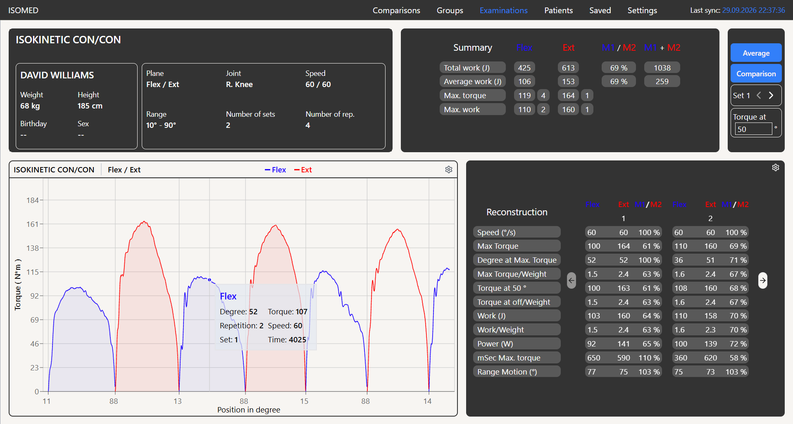
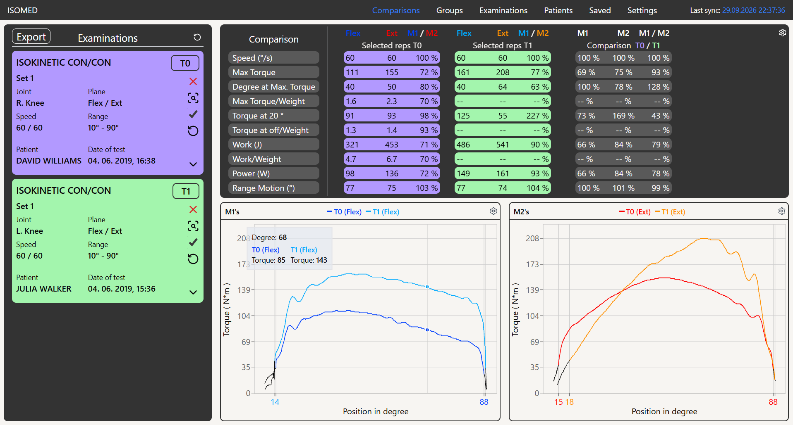
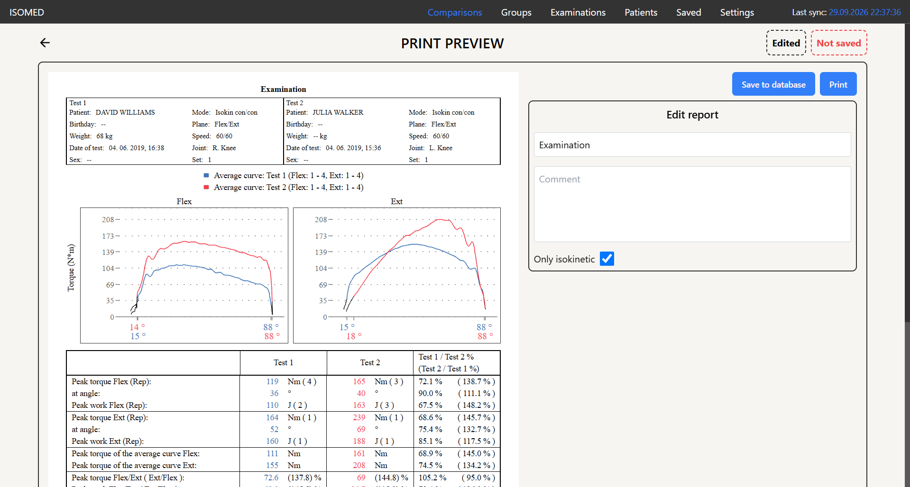

# ISOMED

Web application for importing, storing and visualizing measurements from the **ISOMED isokinetic dynamometer**, which is used at the Sports Activities Centre of Brno University of Technology (CESA VUT) to assess physical fitness.

Built as a bachelor's thesis at the Faculty of Information Technology, Brno University of Technology.





## Features

- Import of measurement files exported from the ISOMED system into a relational database
- Management of patients and their examinations
- Interactive charts of the measured data (torque, position, speed)
- Calculation of key indicators such as peak torque and total work
- Export of results to the required formats

## Tech stack

| Part | Technologies |
|---|---|
| Frontend | React, TypeScript, Vite, Recharts |
| Backend | NestJS (Node.js), TypeScript |
| Database | Prisma ORM with SQLite |

The original thesis version used PostgreSQL. This public version uses SQLite so that the project runs without installing or configuring a database server. Because the data layer goes through Prisma, switching back to PostgreSQL only requires changing the datasource in `backend/prisma/schema.prisma`.

## Getting started

### Prerequisites

- Node.js 22 LTS or newer
- npm

### 1. Backend

```bash
cd backend
npm install
cp .env.example .env        # PowerShell: Copy-Item .env.example .env
npx prisma generate
npx prisma migrate deploy
npx prisma db seed          # loads demo data
npm run start:dev
```

The API runs on http://localhost:3000.

### 2. Frontend

```bash
cd frontend
npm install
cp .env.example .env        # PowerShell: Copy-Item .env.example .env
npm run dev
```

Open the address printed in the terminal (usually http://localhost:5173).

## Demo data

All data in this repository is fictional. Real patient names were replaced with generated ones.

- `npx prisma db seed` loads several demo examinations, so the application is not empty after the first start.
- The `example_data/` folder contains more measurement files. Import them through the application to try the import feature.

## Project structure

```
backend/
  prisma/           database schema, migrations, seed
  src/              NestJS application
frontend/
  src/              React application
example_data/       sample measurement files for trying the import
```

## Troubleshooting

- If the backend complains about a missing `@prisma/client`, run `npx prisma generate`.
